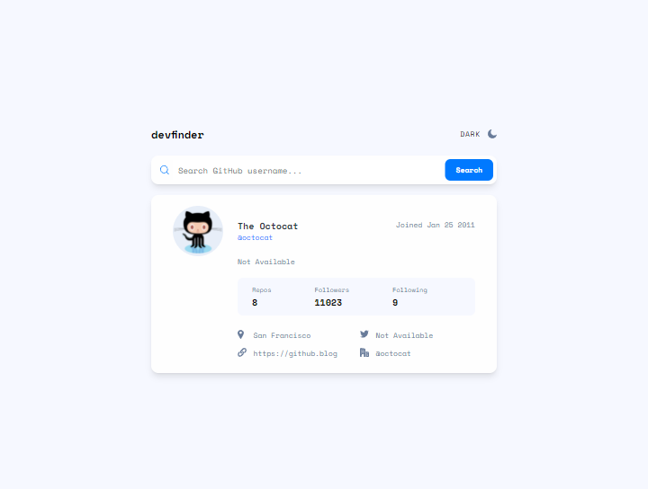
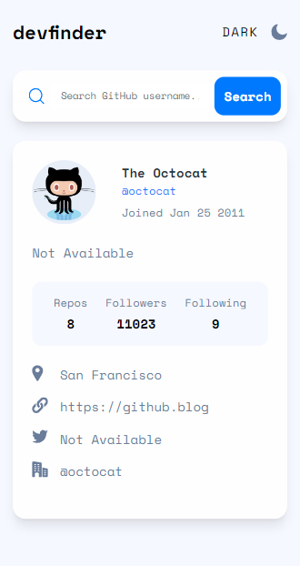

# Frontend Mentor - GitHub user search app solution

This is a solution to the [GitHub user search app challenge on Frontend Mentor](https://www.frontendmentor.io/challenges/github-user-search-app-Q09YOgaH6). Frontend Mentor challenges help you improve your coding skills by building realistic projects. 

## Table of contents

- [Frontend Mentor - GitHub user search app solution](#frontend-mentor---github-user-search-app-solution)
  - [Table of contents](#table-of-contents)
  - [Overview](#overview)
    - [The challenge](#the-challenge)
    - [Screenshot](#screenshot)
    - [Links](#links)
  - [My process](#my-process)
    - [Built with](#built-with)
    - [What I learned](#what-i-learned)
    - [Continued development](#continued-development)
    - [Useful resources](#useful-resources)
  - [Author](#author)

**Note: Delete this note and update the table of contents based on what sections you keep.**

## Overview

### The challenge

Users should be able to:

- View the optimal layout for the app depending on their device's screen size
- See hover states for all interactive elements on the page
- Search for GitHub users by their username
- See relevant user information based on their search
- Switch between light and dark themes
- **Bonus**: Have the correct color scheme chosen for them based on their computer preferences. _Hint_: Research `prefers-color-scheme` in CSS.

### Screenshot

Finished project on a 1440px screen

Finished project on a 375px screen
 

### Links

- Solution URL: [solution on my frontend mentor profile](https://www.frontendmentor.io/profile/zsoltvarju/solutions)
- Live Site URL: [live site on netlify](https://resonant-travesseiro-a9cf6e.netlify.app/)

## My process

### Built with

- Semantic HTML5 markup
- Tailwind CSS
- Mobile-first workflow
- Javascript
- GSAP
- AXIOS

### What I learned

During the development of this app, I learned and practiced a lot while using APIs. I used the Axios library to interact with the API, which became increasingly familiar to me. I was introduced to a new application called Postman, which I used to analyze the API data. I added some error handling with a callback and a counter that triggers if the user is not found or when there are too many API requests in a short time. This was also my first project where I implemented dark and light themes. It was fun learning about this feature, and I added a script to check the base theme settings of the user and use a color palette according to the user's preference. Additionally, this was my first project using Tailwind CSS. Initially, it was overwhelming, but as I neared the end of this project, it became easier to use. I really like it and definitely plan to use it in future projects. I see a greater advantage of using it in React, where components are used, because in a simple HTML website like this, the large number of class names can be a bit overwhelming. In the end, I also used GSAP to animate everything and used JavaScript modules for the first time to import animation functions from the animations.js file to my ApiHandler.js file.

Overall, I really liked this project. It was challenging but also fun, and I learned a lot from it.

### Continued development

There is plenty of room for improvement in this project. One aspect that could enhance its appearance is implementing a real-time search as the user types in a name. I definitely want to try that, but I need to consider implementing a function to prevent excessive API requests with every keystroke. Additionally, more error checks and a test file to verify functionality would be beneficial. I may add these features later as well.

### Useful resources

- Kevin Powell's  [blog](https://www.kevinpowell.co/) I highly recommend his channel to anyone who wants to learn web development.
- Josh Comeau's [blog](https://www.joshwcomeau.com/) I also recommend his channel to anyone who wants to learn web development.
- Dave Gray's [blog](https://daveceddia.com/) I also recommend his channel to anyone who wants to learn web development.
- [MDN](https://developer.mozilla.org/en-US/) I think this is the best place to look up things.

Some pages i wish i could find earlier:
- [CSS Tricks](https://css-tricks.com/)
- [CSS Cheat Sheet](https://htmlcheatsheet.com/css/)
- [HTML Cheat Sheet](https://htmlcheatsheet.com/)
- [JS Cheat Sheet](https://htmlcheatsheet.com/js/)
- [CSS Grid Cheat Sheet](https://grid.malven.co/)
- [Flexbox Cheat Sheet](https://flexbox.malven.co/)

## Author

- Frontend Mentor - [@zsoltvarju](https://www.frontendmentor.io/profile/zsoltvarju)
- LinkedIn - [Zsolt Varjú](https://www.linkedin.com/in/zsolt-varj%C3%BA-019419234/)
